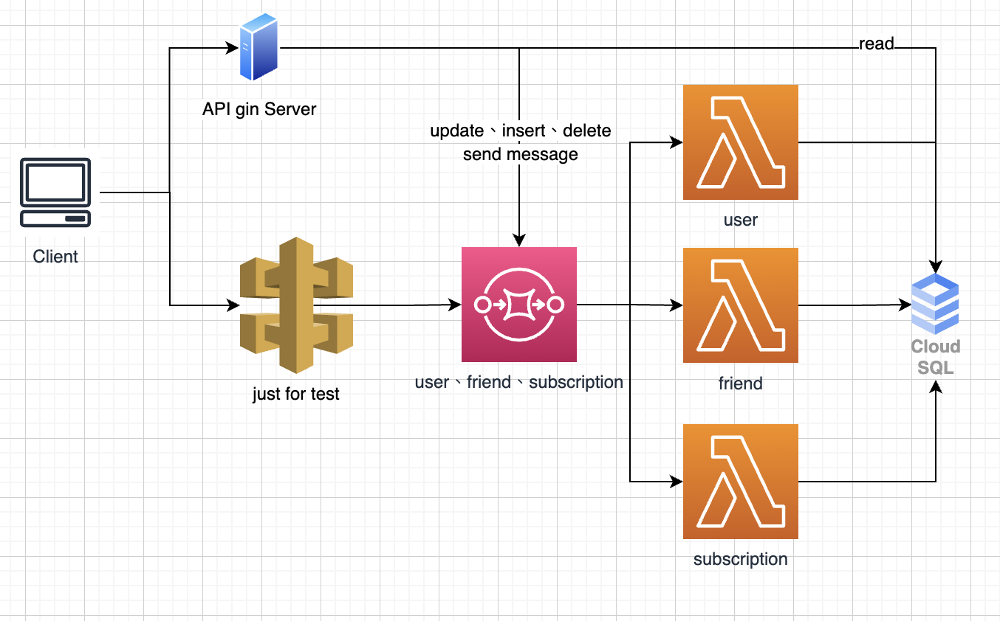
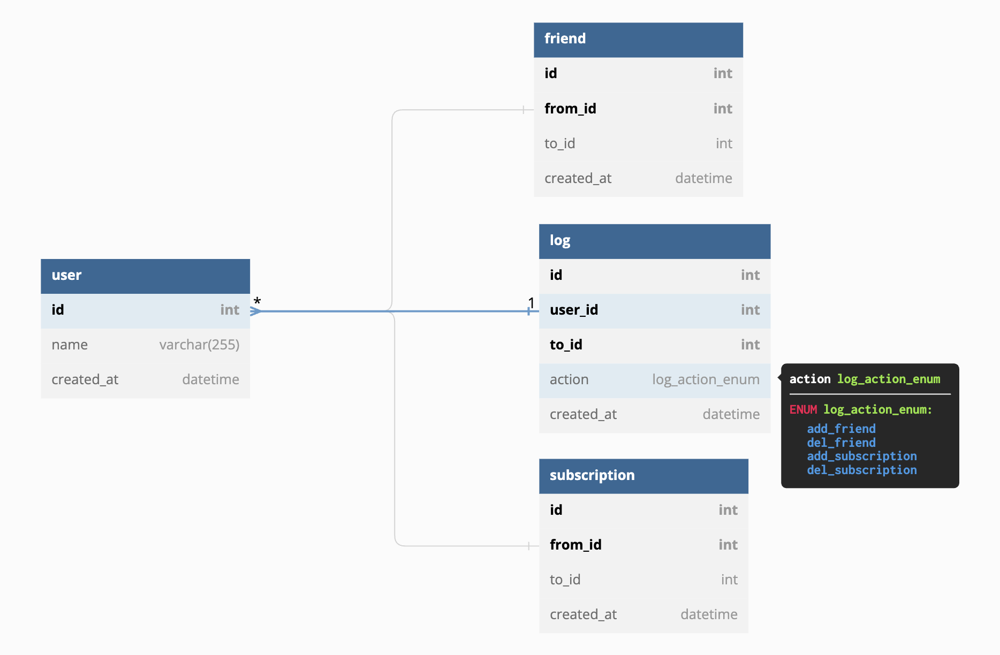

# 主要技術棧
- AWS CDK (typescript)
  - lambda
  - sns
  - apigw
  
- lambda 使用golang
  - 放在lambda資料夾中
- api service 使用golang (gin)
  - 放在api資料夾中

## 使用前安裝
* nodejs
* go
* cdk

## 如何使用
* `cp .env.sample .env` 
* 忝入相關env資訊
* `cdk bootstrap aws://ACCOUNT-NUMBER/REGION`
* `cdk deploy`
* 匯入資料表
* `cd api && go `

## CDK相關指令
* `npm run build`   compile typescript to js
* `npm run watch`   watch for changes and compile
* `npm run test`    perform the jest unit tests
* `cdk deploy`      deploy this stack to your default AWS account/region
* `cdk diff`        compare deployed stack with current state
* `cdk synth`       emits the synthesized CloudFormation template

# 架構

# DB Schema

